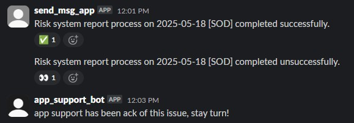
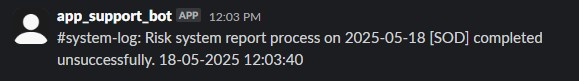

# Slack App Support Bot

## 📘 Overview

This is a lightweight Slack bot built using Python and Slack's Bolt framework. It monitors system log channels for messages indicating system issues and automatically forwards those messages to a centralized support channel for easier visibility and faster response by the app support team.

---

## 🎯 Purpose

Currently, system logs are posted across multiple Slack channels, making it difficult and time-consuming for the app support team to monitor and follow up on potential issues.

This bot listens to messages in designated system channels, detects potential errors (e.g., "unsuccessfully" or failure patterns), and automatically sends those messages to the `#app-support-request-logs` channel. This reduces the manual effort and ensures faster issue resolution.

---

## ✨ Features

- Monitors system messages from a specific Slack channel (e.g., `#system-log`)
- Detects success and failure patterns in messages
- Adds reactions (✅ for success, 👀 for error)
- Forwards error messages to a central support channel
- Responds to bot mentions by forwarding the message as a support request

---

## 🛠 Technologies Used

- Python 3.10
- [Slack Bolt for Python](https://slack.dev/bolt-python/)
- [Slack SDK](https://slack.dev/python-slack-sdk/)

Dependencies listed in `requirements.txt`.

### Slack_bot

Slack bot configurate as `app_support_bot Manifest`

---

## ⚙️ Setup and Installation

```bash
git clone https://github.com/NotEnough1130/slack_bot_for_monitoring.git
cd slack_bot_for_monitoring
pip install -r requirement.txt #install dependancies
python3 ./app_support_bot.py
```

## ✨ Demo walk through

Here’s how the Slack App Support Bot operates in a typical workflow:

System Logging

The #system-log channel continuously receives automated messages from a report generation system.

These messages indicate the progress of various steps—whether each part of the process completes successfully or fails.

Bot Setup

The @app_support_bot is invited to the #system-log channel.

Once the bot is running on a machine, it starts listening for messages in real-time.

Message Monitoring and Response

As the system posts status messages into the #system-log channel, the bot processes each message and responds based on its content:

✅ Success Pattern Matched:
If the message matches a predefined success pattern (e.g., "completed successfully"), the bot reacts with a ✅ emoji.

👀 Failure Detected:
If the message includes keywords like "unsuccessfully" or matches a known error format:

The bot reacts with an 👀 emoji.

It forwards the message to #app-support-request-logs with a timestamp for visibility.



It posts a follow-up message in the original channel to confirm that app support is aware and investigating.



🚫 Other Messages:
Messages that don't match any success or failure patterns are ignored

## 🎯Futher Development

- Adding function to handle multiple pm's channels request
- Link with third party incident app
